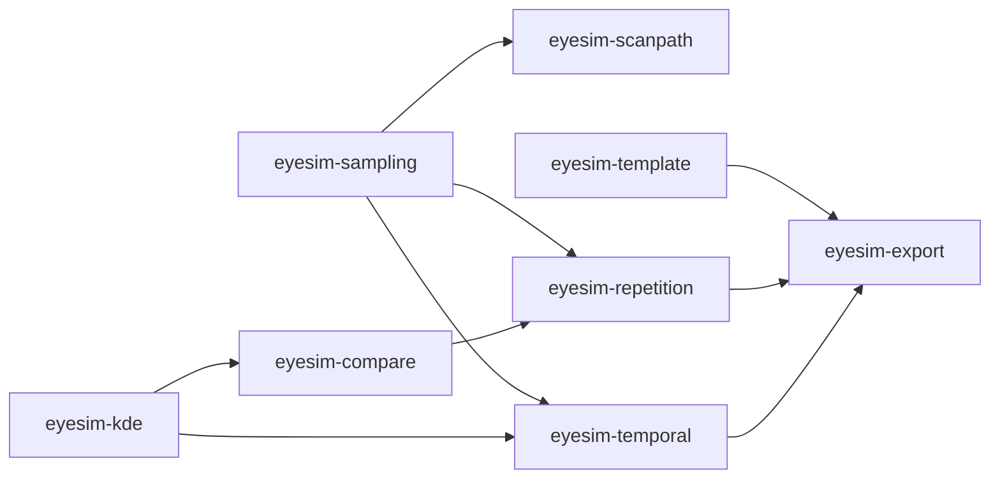

# Review of the next implementation queue, 2026-09-19

Reviewed the twelve requested Motes against the current local source, their dependency/decision
records, the baseline manifest, the pinned eyesim Git object, public guides and existing test evidence.
This was backlog correction and acceptance design, not implementation of the remaining methods.
Earlier uncommitted work was preserved. The exact reference pin remains solely in
[`baseline.json`](../tools/r-parity/baseline.json).

## Disposition

One stale-open epic is closed; the other eleven remain open with bounded deliverables.
The dependency graph now distinguishes six tickets that can start immediately from five with
unfinished completion prerequisites. This is not a new scientific parity claim.

| Ticket | Review finding | Concrete remaining gate |
|---|---|---|
| `cd-codecs` | **Closed as stale.** Trials, timelines, manifests, recording/temporal archives, compatibility and law/registry coverage are delivered. | Regression enforcement remains; future feature schemas belong to their owning feature. General app-boundary deferrals do not reopen this shipped-family epic. |
| `doc-mdoc` | Site/build/CI scaffold exists; the body falsely implied a new site was needed. The checker covers curated pages, not all linked legacy examples. | Finite executable-example inventory, drift enforcement, truthful native-workflow guidance, rendered review and exact-source hosted CI evidence when published. No deployment requirement. |
| `eyesim-compare` | Internal comparisons exist but broad R dispatch and multiscale evidence are absent. Names concealed different estimands. | Explicit dispatch/result-type matrix, native missing methods, independent edge cases, full scale evidence and measured intentional EMD divergence. |
| `eyesim-export` | Existing CSV/JSON support is substantial. 'Every supported result' was unbounded; Arrow ownership was ambiguous. | Freeze result-family schemas; actual exported artifacts and independent readback; explicit JVM-only Arrow residual retained from `io-export`. |
| `eyesim-kde` | Native smoothing is not ks/MASS conformance. Point-evaluation wording was wrong. | Separate estimator/bandwidth and nearest-grid lookup contracts, normalization/edge/failure evidence and preserved query/group cardinality. |
| `eyesim-repetition` | The cosine/direct facade and generic Trials codecs already exist. Arbitrary relation persistence does not. | Remaining methods/scale reductions plus named projection/relation/finite-selection persistence and exact direct-versus-reopened edges/provenance. |
| `eyesim-sampling` | Title implied random density draws; body treated distinct fast/slow lookup semantics too uniformly. | One total deterministic trajectory primitive, checked replication, and reproducible finite-control eligibility/selection evidence. |
| `eyesim-scanpath` | Python MultiMatch evidence is real but not eyesim evidence; overlap and transport semantics were underspecified. | Pinned component/window/threshold/denominator behavior, shared trajectory lookup and separate spatiotemporal Sinkhorn qualification. |
| `eyesim-template` | Shared native QR/OLS is delivered, but the public workflow still runs R and its method ID says so. Fixed-feature evidence does not prove learned-feature safety. | Native fit integration first; then a frozen training-only learned recipe with leakage controls, followed by separately qualified CV and surface-regression workflows. |
| `eyesim-temporal` | Epoch selectors/bins are delivered; duration occupancy is not static-template point sampling. | Compose shared trajectory/density semantics, pin endpoint/bin/control aggregation, and persist an explicit point-sampling plan/result. |
| `v-coverage` | Large test counts and consumer tests do not prove every public entry point executes. | Candidate-bound public-symbol inventory, executed-evidence mapping, gap closure and CI drift sensitivity. |
| `x-session` | Still absent; parser sessions and document identity registries are not the checked design container. | Immutable checked admissions, total missing-key behavior, stable failed-update semantics and external forged-access/alias probes. |

## Source findings that change implementation acceptance

These are observations from the pinned source, not newly generated conformance fixtures.
The affected manifest descriptions were corrected without changing any case's status or evidence.

- `R/similarity.R:sample_density.density` interpolates coordinates to grid indices, rounds,
  and reads a single cell. Finite outside queries clamp through `approx(..., rule=2)`.
  This is neither bilinear value interpolation nor automatically equivalent to native
  [`Surface.sampleAt`](../kernel/src/main/scala/eyes4s/kernel/Surface.scala)'s containing-cell
  lookup and outside `None`. Normalization occurs before lookup; zscore uses sample SD.
- `R/fixations.R:sample_fixations.fixation_group` has two distinct policies: fast constant-step
  approximation is missing after the final onset and averages ties; slow lookup holds the last
  row and resolves equal onsets differently. Neither censors inter-fixation gaps by duration.
  `rep_fixations` truncates floating replicate counts and enforces a minimum of one.
- `R/similarity.R:compute_similarity` implements `l1` as **1 minus total variation**, `dcov`
  through **distance correlation** (`energy::dcor`), and Jaccard through `proxy`'s extended
  Jaccard. Raw transport costs, transformed similarities and debiased divergences must remain
  distinct. The multiscale dispatcher does not expose EMD, Sinkhorn or overlap.
- `R/overlap.R:fixation_overlap` uses strict `< dthresh` and divides by every requested query,
  including missing distances. Its threshold-60/20-unit default differs from the
  threshold-40 facade, which requires supplied times. These defaults must not be flattened.
- `R/similarity.R:sample_density_time` uses the fast step trajectory over a static template.
  Its `cut(right=FALSE, include.lowest=TRUE)` endpoint behavior must be measured, not assumed
  equivalent to every native half-open interval. It averages controls at each time before
  aggregating bins; changing that order changes the estimand with unequal missing support.
- `R/repetitive_similarity.R` averages available scales per pair before averaging comparisons.
  Native failures and unmatched scales remain explicit even where the reference drops them.
- [`TemplateFit.scala`](../design/src/main/scala/eyes4s/design/TemplateFit.scala) still exposes
  an R-labelled imported fit, while [`LeastSquares.scala`](../design/src/main/scala/eyes4s/design/LeastSquares.scala)
  and [`SurfaceDecomposition.scala`](../design/src/main/scala/eyes4s/design/SurfaceDecomposition.scala)
  supply the native solver. The 2026-09-18 owner decision forbids required runtime R.
  A new native method must not silently reinterpret the old saved method/schema identity.
- PRD G-11 validates **membership**, not arbitrary key existence. A missing Session key must
  return `Option` or a typed absence; calling a throwing map accessor 'total' would violate
  the very guarantee this container is meant to establish. `Agreement` remains the sole
  frame/clock compatibility mechanism, including nominal-ID/specification conflicts.

## Ownership and completion graph

`A -> B` below means **B needs A to close**, not that every independent subtask in B must wait.
In particular, comparisons on supplied maps, export schema work and repetition persistence
can be developed before all their integration evidence is qualified.

Nonblocking related links identify shared contracts: sampling/KDE at the density-times join;
scanpath/comparison for EMD reference evidence; template with KDE/comparison; documentation with
coverage and the native template route; Session with app-prereq. They are not duplicate ownership.
The closed S5, S6 and archive follow-up are now explicit codec completion dependencies.
Existing broad milestone/parent links were retained; none was invented as a work prerequisite.

## Recommended implementation order

1. **`x-session`: checked container.** A bounded architectural gap with closed prerequisites;
   follow with the existing `app-prereq` adapter ticket. No persistence or application storage
   engine is required to establish the insertion/access invariant.
2. **`eyesim-template`, native fixed-feature slice.** Reuse the delivered QR, retire the
   required R step from guide/CLI, preserve old receipt/schema meaning, and retain exact
   coefficients and held-out controls. Keep the broader ticket open for learned construction.
3. **`eyesim-sampling` and `eyesim-kde`: freeze and qualify shared primitives.** Establish
   trajectory endpoints, density lookup and normalization before composing temporal/overlap
   workflows. Keep reference oddities as explicit observations or divergences.
4. **`eyesim-compare` and `eyesim-scanpath`: method-specific conformance.** Reuse shared
   primitives and exact-EMD reference evidence. Never conflate Python, R and native evidence.
5. **`eyesim-repetition` and `eyesim-temporal`: workflow composition and persistence.** Retain
   typed identity, direction, realized denominators, failures and aggregation order. Complete
   the remaining learned-template workflow once its recipe is frozen.
6. **`eyesim-export`: complete the finite output matrix and JVM Arrow residual.** Start
   row/schema design earlier; close only when the required workflow outputs are covered.

Start `v-coverage`'s inventory and `doc-mdoc`'s example inventory alongside these slices, then
rerun their gates on the final candidate. Do not defer all documentation and API exercise until
an entire baseline epic is nominally complete.

## Evidence and limits of this review

- `mote show`, decision history, live readiness and source/test inspection covered all twelve
  tickets. No remaining scientific implementation gap was closed merely from symbol presence.
- Fresh checks: `codecJVM` and `codecJS` ran SchemaCompatibilitySuite, ResultArchivesV1Suite,
  ArchiveManifestSuite and ArchiveReconstructionSuite; `lawsJVM` ran SchemaRegistryJvmSuite.
  **74 tests passed.** Log: `/tmp/eyes4s-mote-review-codec-checks.log`.
- The prior full **3,622-test** local JVM/JS gate and mutation receipts are recorded in
  [the assembly evidence](evidence/detection-assembly-final.md); this review did not claim a new
  full-suite run. Fresh-process/package evidence for codec closure is the existing UI-S6 and
  recording/temporal archive completion evidence, not a new publication in this review.
- `check_baseline.py --eyesim /Users/bbuchsbaum/code/eyesim --mote` and `tools/check-docs.py`
  pass after metadata corrections. No frozen fixture inputs, output digests, reference pin,
  case evidence statuses, thresholds or implementation code were changed by this review.
- Mote audit has no structural errors. Local uncommitted operations remain local; this review
  does not claim hosted CI, deployed documentation or published artifacts.
