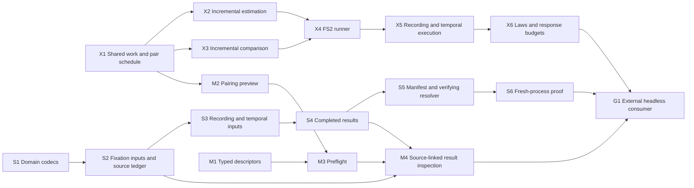

# eyes4s infrastructure for an external UI consumer

Implementation plan lodged in Mote on 2026-09-16. This is an authorized plan,
not implementation or passing-test evidence. The UI will live in another
repository; [the app vision](UI_APP_VISION.md) supplies the intended consumer.

The existing application-boundary owner is
`bd-01M02N4GM03BF98C3PSJS6D4WA`. This plan creates **17 implementation tickets**:
six execution, six serialization, four inspection/preflight, and one final
consumer proof. Each ticket is open and unassigned until someone starts it.
Planning and registration are tracked separately by
`bd-01M2N2EHPN8XGSRHCMXF65NHAQ`.

## Outcome and ownership

A separate application can discover a supported analysis, inspect its parameters
and actual pairing design, reconstruct its scientific inputs, execute with useful
progress and cancellation, inspect the full result and its source evidence, and
save/reconstruct/rerun it through packaged eyes4s APIs.

| Concern | eyes4s owns | Consumer application owns |
|---|---|---|
| Execution | Pure bounded scientific work; FS2/Cats Effect interpretation; progress, outcome and cancellation contracts | Job scheduling policy, widgets, thread dispatch, navigation |
| Persistence | Scientific value codecs, schema/identity contracts, manifest and verification against an injected byte source | Project layout, asset locations, autosave, crash recovery, missing-file repair |
| Inspection | Typed scientific descriptors, eligibility/design previews, prerequisites, diagnostics and result projections | Form layout, draft interaction state, localized wording, graphics and selection appearance |

No JavaFX or Intaglio dependency enters eyes4s. Effects stay in `io`/`fs2`;
`plan` and `codec` stay acyclic and pure. Kernel vocabulary remains neutral.
Generic renderer/input-adapter work belongs in Intaglio, and app-specific
graphics belong in the consuming repository.

## Scope and current foundation

Source review at `6218627` establishes a concrete foundation:

- `StudyPlan`, `RecordingPlan`, and `TemporalStudyPlan` already describe, diff
  and execute scientific operations; each has a versioned plan codec.
- The ordinary study runner eagerly traverses scales/trials and evaluates pairs.
  The FS2 module supplies `Machine.toPipe`, not a cancellable study interpreter.
- `MeasureInfo`, detector cards, plan descriptions, typed errors, artifact
  references and conditional `VersionedCodec` already exist. Extend them.
- Inputs still need to be supplied to a loaded plan. A saved plan alone is not
  a reconstructible scientific object graph or an application project.
- The isolated study consumer already exercises custom comparison/detector
  registrations and JVM/JS evidence. Extend that tool rather than start an
  unrelated proof harness.

The primary vertical slice is the existing fixation-study route: binned and
Gaussian duration/uniform-weighted maps, exhaustive within-participant
matched/control cosine comparisons, typed custom extension evidence and full
result accounting. The plan also carries the currently shipped recording and
temporal families through the same contracts. It does not add scientific method
breadth, arbitrary control sampling, a general statistical engine or all eyesim
parity cases. Broader Session, generic Timeline and AOI work retains its own scope.

Stable trial identity includes participant/stimulus/phase and an explicit occurrence
or session when needed, through a supported typed layout. Neither a display label
nor a digest is a collision-free observation identity. Fixation-only input does
not establish raw observation coverage.

## Construction order

Start **X1** first. **S1** and **M1** are independently ready foundations.
X1 supplies both the work schedule and pairing preview; the numerical runner and
preflight must not maintain separate pairing rules.

- Execution: X1 -> X2 and X3 -> X4 -> X5 -> X6.
- Serialization: S1 -> S2 -> S3 -> S4 -> S5 -> S6.
- Inspection: M1 plus X1 -> M2 -> M3; M3 plus S2/S4 -> M4.
- Final consumer: X6 plus S6 plus M4 -> G1.

The sequence above is a readable overview; each ticket lists all concrete direct
dependencies. Parent/child ownership uses non-blocking Mote relationships.
Blocking dependencies point to actual prerequisite outputs, not the containing
epic. Existing broad owners acquire the relevant completion gate while retaining
their previous acceptance requirements; this plan does not declare them complete.



## Shared acceptance rules

1. **Same science.** Pure, incremental, streamed and restored execution consume
   the same scientific implementation and pairing schedule. Test complete values,
   keys, failures, exclusions, provenance and denominators. A green rounded CSV
   comparison alone is insufficient.
2. **Explicit reproducibility.** Exact keys, ordered identities, 64-bit time,
   semantic digests and designated binned results stay exact. Gaussian comparisons
   retain the existing named tolerance contract (currently absolute `1e-12` for
   designated study fixtures); new numerical laws declare a named `Tolerance`.
   Content verification is exact and never uses a numerical tolerance.
3. **Actually cancellable.** Yields must occur inside expensive supported
   operations, including setup. Cancelling before the specified result commit
   cannot produce a completed result. A cancelled stream need not emit a terminal
   progress event; the run's authoritative outcome must still be observable.
4. **No invented support.** Synchronous custom closures cannot be advertised as
   bounded work without a concrete supporting implementation. Missing observation
   coverage, unmatched trials and failed comparisons remain explicit data.
5. **Test independent meaning.** Reuse rational cosine/contrast, decimal Gaussian
   and integer-overlap temporal fixtures. Add a small direct-sum non-square edge
   oracle where the current symmetric Gaussian fixture is insufficient. Proposed
   tests establish eyes4s semantics, not unmeasured eyesim equivalence.
6. **Prove new laws.** Publish pure law suites in `eyes4s-laws`; demonstrate
   sensitivity with deliberate mutants. Effectful cancellation/resource tests
   belong in `fs2`. Claims of static rejection require `typeCheckErrors`.
7. **Preserve decoding guarantees.** Register custom codecs explicitly, reject
   conflicting identities and malformed payloads, and check previous-schema
   fixtures. Migrate only when meaning can be preserved; otherwise return a named
   incompatibility. Caller mutation must not invalidate accepted artifact identity.
8. **Bound performance claims.** Unit tests use barriers/test clocks and work
   counters rather than wall-clock sleeps. A separate pinned-runtime benchmark
   measures response/cancellation and memory on declared workloads. The proposed
   100 ms JVM cancellation target is a target to freeze and test, not a current
   measurement or a portable hard real-time guarantee.

Implementation slices run their affected JVM/JS suites. The final integration runs:

```sh
sbt compileAll
sbt headerCheckAll scalafmtCheckAll scalafmtSbtCheck githubWorkflowCheck
sbt testAll checkBoundaries
python3 tools/study-consumer/verify.py
```

Update the consumer command only if its actual interface changes. Generated GitHub
workflows are changed through `build.sbt` and `githubWorkflowGenerate`.
No implementation suite was run merely to register this plan.

## Ticket index

| Key | Mote ticket | Deliverable | Direct prerequisites |
|---|---|---|---|
| [X1](#x1) | `bd-01M2N2QA11Y97G7R2PR5630ZAQ` | Extract shared deterministic study preparation and pair scheduling | Ready |
| [X2](#x2) | `bd-01M2N2QAK3PH8QGFAZ1YFR15W0` | Make occupancy and Gaussian estimation resumable within a trial | X1 |
| [X3](#x3) | `bd-01M2N2QB107Y48TXK39XK8NWBX` | Make cosine comparison and study reduction bounded and deterministic | X1 |
| [X4](#x4) | `bd-01M2N2QBJ638R8GZAT5P2EWM33` | Add the FS2 study runner with progress, cancellation and terminal outcomes | X2, X3 |
| [X5](#x5) | `bd-01M2N2QC7RA8RZHW7EH2F2R9GA` | Compose recording and temporal plans through the bounded runner | X4 |
| [X6](#x6) | `bd-01M2N2QCWATK57DT0TEWTRJTCP` | Publish execution conformance laws and qualify responsiveness budgets | X5 |
| [S1](#s1) | `bd-01M2N2QDDGDDPC7Q2TRV08D03F` | Define reusable geometry, time and identity codecs for scientific payloads | Ready |
| [S2](#s2) | `bd-01M2N2QDV9JB6T6AYZG3D0TT3X` | Serialize fixation-study inputs and explicit admission/source ledgers | S1 |
| [S3](#s3) | `bd-01M2N2QEDSTM8XK40WW2SG3E8R` | Serialize normalized recordings and temporal study input payloads | S1, S2 |
| [S4](#s4) | `bd-01M2N2QEWQMWBSNRC30RQ5CCPP` | Encode completed scientific results, typed failures and provenance | S1, S2, S3 |
| [S5](#s5) | `bd-01M2N2QFF4NCTFZFDF87ZH3ERF` | Add typed artifact manifests and an injected verifying resolver | S2, S3, S4 |
| [S6](#s6) | `bd-01M2N2QFZSGT9TG6ZEK5THE1CR` | Prove fresh-process reconstruction, schema compatibility and codec laws | S5 |
| [M1](#m1) | `bd-01M2N2QGJ7MECZAHWC01ER9CMT` | Expose typed parameter and method descriptors for the shipped recipes | Ready |
| [M2](#m2) | `bd-01M2N2QH044FSDXJTERDZ5EZRS` | Expose bounded pairing previews from the executable study schedule | X1 |
| [M3](#m3) | `bd-01M2N2QHGNAN5V3R34NP2B9Q7E` | Add typed recipe availability and scientific prerequisite reports | M1, M2 |
| [M4](#m4) | `bd-01M2N2QJ1H158B984E0Z7YBTGK` | Expose stable source-linked diagnostics and inspectable result projections | M3, S2, S4 |
| [G1](#g1) | `bd-01M2N2QJKD231A7MJ3NFF2H6Q6` | Qualify the three infrastructure APIs in an isolated headless app consumer | X6, S6, M4 |

## Detailed tickets

<a id="x1"></a>

### X1 — Extract shared deterministic study preparation and pair scheduling

Mote: `bd-01M2N2QA11Y97G7R2PR5630ZAQ`. Existing owner: `app-progress`.
Priority: 0. Direct prerequisites: none; ready.

**Scope and proposed paths**

- `plan/src/main/scala/eyes4s/plan/StudyPlan.scala`
- `plan/src/main/scala/eyes4s/plan/StudyWork.scala (new)`
- `design/src/main/scala/eyes4s/design/Paired.scala`
- `plan/src/test/scala/eyes4s/plan/StudyWorkSuite.scala (new)`

These are implementation boundaries, not active reservations. Inspect current
ownership and reserve only the exact files needed when starting the ticket.

**Implementation**

- Extract validated preparation and the within-participant matched/control schedule from StudyPlan.runScale. Keep one scientific path for the existing pure runner, subsequent resumable execution, and pairing previews.
- Preserve typed keys, trial and scale ordering, nominal geometry checks through Agreement, excluded phases, ambiguous/unmatched groups, and FailurePolicy semantics. Use a deterministic cursor or bounded enumeration; do not eagerly materialize an unbounded Cartesian pair table.
- Bind prepared work to input, layout, method/version and plan identity. State which preparation operations are themselves bounded; expose declared budgets and operand-bearing over-budget errors. No effects, UI types, or replacement general plan framework.

**Proposed tests**

- Manual independent edge lists for a 2-participant, 3-stimulus study: include missing references, duplicate matches and same-stimulus exclusions; compare scheduled keys and realized counts without using the schedule builder as the oracle.
- Compare existing StudyGuide scalar and multiscale outputs, all failure rows and denominators before/after extraction using pinned rational/decimal targets and existing tolerances.
- Exercise chunk boundaries, reordered inputs under the declared ordering policy, distinct keys with identical display strings, and pair-count overflow/budget refusal before full allocation.

**Completion criterion:** The old pure API produces unchanged scientific results and accounting; one public prepared-work representation supplies both execution and preview, with bounded schedule enumeration.

<a id="x2"></a>

### X2 — Make occupancy and Gaussian estimation resumable within a trial

Mote: `bd-01M2N2QAK3PH8QGFAZ1YFR15W0`. Existing owner: `app-progress`.
Priority: 1. Direct prerequisites: X1 (`bd-01M2N2QA11Y97G7R2PR5630ZAQ`).

**Scope and proposed paths**

- `kernel/src/main/scala/eyes4s/kernel/PointMeasure.scala`
- `surface/src/main/scala/eyes4s/surface/Smoother.scala`
- `surface/src/main/scala/eyes4s/surface/EstimationWork.scala (new)`
- `surface/src/test/scala/eyes4s/surface/EstimationWorkSuite.scala (new)`

These are implementation boundaries, not active reservations. Inspect current
ownership and reserve only the exact files needed when starting the ticket.

**Implementation**

- Expose bounded pure work for occupancy binning, Gaussian kernel preparation, convolution passes and normalization. Wire the supported StudyEstimate branches to it while retaining direct smooth/density calls as drains of the same implementation.
- Define a checked work quantum plus grid/kernel allocation limits. Audit every long loop, including initialization and copying, rather than adding yields only between complete trials.
- Preserve accumulation order, sigma-as-standard-deviation, Truncate/Renormalise behavior, mass semantics, provenance and typed failures. Reuse Agreement; return explicit unsupported/budget errors rather than silently approximating a costly operation.

**Proposed tests**

- Drain with work budgets 1, small primes and larger-than-work; require identical designated outputs and compare Gaussian values with the existing independent high-precision fixture.
- Add an independent direct-sum small non-square grid oracle with centre/edge/corner impulses for both edge policies; named tolerance, including degenerate bandwidth, no mass and frame mismatch cases.
- Instrument primitive work counts to prove each step's bound; test interruption/disposal during kernel construction, each convolution pass and normalization without exposing a partially constructed Mass.

**Completion criterion:** One large supported map can yield between bounded operations; direct and incremental estimation retain the same semantics, error cases and numeric evidence.

<a id="x3"></a>

### X3 — Make cosine comparison and study reduction bounded and deterministic

Mote: `bd-01M2N2QB107Y48TXK39XK8NWBX`. Existing owner: `app-progress`.
Priority: 1. Direct prerequisites: X1 (`bd-01M2N2QA11Y97G7R2PR5630ZAQ`).

**Scope and proposed paths**

- `compare/src/main/scala/eyes4s/compare/Distribution.scala`
- `compare/src/main/scala/eyes4s/compare/ComparisonWork.scala (new)`
- `design/src/main/scala/eyes4s/design/Analysis.scala`
- `plan/src/main/scala/eyes4s/plan/StudyWork.scala (new)`
- `compare/src/test/scala/eyes4s/compare/ComparisonWorkSuite.scala (new)`

These are implementation boundaries, not active reservations. Inspect current
ownership and reserve only the exact files needed when starting the ticket.

**Implementation**

- Provide incremental cosine dot/norm work, pair evaluation and mean/contrast reduction for the MVP, retaining per-pair errors and selected/successful/failed/contributing counts.
- Use deterministic reduction ordering across work quanta. Keep structured custom score capabilities typed; do not flatten score components or infer laws from a display name.
- Define the extension contract for bounded custom comparisons. A synchronous arbitrary closure cannot advertise bounded cancellation; report that capability explicitly and give the isolated scaled-cosine extension a concrete supported instance.

**Proposed tests**

- Independent hand-calculated cosine and matched-minus-control examples, plus zero norms, incompatible grids, overflow/non-finite cases and RequireAll versus other supported failure policies.
- Vary quantum and pair order according to the declared contract; compare every pair outcome, reduced denominator and signed component with the pure runner.
- Prove a long single comparison yields, an unsupported synchronous extension is diagnosed before a bounded run, and wrong score/parameter types are rejected with typeCheckErrors.

**Completion criterion:** Supported comparison and reduction work is interruptible within large pairs and preserves scientific ordering/accounting; extension guarantees are explicit.

<a id="x4"></a>

### X4 — Add the FS2 study runner with progress, cancellation and terminal outcomes

Mote: `bd-01M2N2QBJ638R8GZAT5P2EWM33`. Existing owner: `app-progress`.
Priority: 1. Direct prerequisites: X2 (`bd-01M2N2QAK3PH8QGFAZ1YFR15W0`), X3 (`bd-01M2N2QB107Y48TXK39XK8NWBX`).

**Scope and proposed paths**

- `fs2/src/main/scala/eyes4s/fs2/StudyExecution.scala (new)`
- `fs2/src/test/scala/eyes4s/fs2/StudyExecutionSuite.scala (new)`
- `build.sbt`

These are implementation boundaries, not active reservations. Inspect current
ownership and reserve only the exact files needed when starting the ticket.

**Implementation**

- Interpret bounded pure work in eyes4s-fs2 with Cats Effect cooperative yields. Provide run identity, stage and completed/total progress when totals are known; represent unknown totals explicitly.
- Specify one authoritative success/failure/cancel outcome and separate observer telemetry from completed scientific results. Cancellation may end an FS2 stream without a final progress event; the run handle/outcome remains authoritative.
- Define bounded progress buffering/backpressure or coalescing, observer disposal, resource finalization and a terminal commit point. A cancellation winning before commit cannot publish a completed result. Bind events/results to the submitted plan/input revision; UI scheduling remains external.
- Keep cats-effect/fs2 out of pure modules and preserve the synchronous API. No JavaFX dispatching, GUI job manager or implicit retries.

**Proposed tests**

- Use Deferred/barriers or Cats Effect test control, not sleeps, to cancel before work, during estimation/comparison/reduction and immediately before result commit; inspect the final outcome and absence of a success result.
- Verify stage transitions, run IDs, monotone per-stage counts, explicit unknown totals, slow/detached observers, bounded buffering and exactly-once finalization.
- Run to completion at several quanta and compare full results/provenance with the pure runner; execute checkBoundaries.

**Completion criterion:** A consumer can observe and cancel real scientific work with bounded resources and unambiguous terminal semantics; completed results match the pure runner.

<a id="x5"></a>

### X5 — Compose recording and temporal plans through the bounded runner

Mote: `bd-01M2N2QC7RA8RZHW7EH2F2R9GA`. Existing owner: `app-progress`.
Priority: 1. Direct prerequisites: X4 (`bd-01M2N2QBJ638R8GZAT5P2EWM33`).

**Scope and proposed paths**

- `plan/src/main/scala/eyes4s/plan/RecordingPlan.scala`
- `plan/src/main/scala/eyes4s/plan/TemporalStudy.scala`
- `core/src/main/scala/eyes4s/core/WindowOccupancy.scala`
- `fs2/src/main/scala/eyes4s/fs2/RecordingExecution.scala (new)`
- `fs2/src/main/scala/eyes4s/fs2/TemporalExecution.scala (new)`

These are implementation boundaries, not active reservations. Inspect current
ownership and reserve only the exact files needed when starting the ticket.

**Implementation**

- Extend the same execution vocabulary to shipped recording and temporal plans: bounded sample preprocessing/detection, AOI aggregation and window-occupancy preparation, then reuse study estimation/comparison work.
- Retain Machine flush semantics: finite successful input flushes once; a cancelled run does not manufacture a finished event. Preserve measured/derived sample provenance and exclusions.
- Retain explicit anchors, observed coverage, window labels, repetition direction, boundary policies and scale identity. Do not infer observed support from fixation gaps.
- State bounded-step requirements for custom detectors; adapt the existing external detector proof rather than inventing a second registration mechanism.

**Proposed tests**

- Pure versus streamed RecordingPlan parity including chunk-spanning events, flush-at-end, invalid synchronization and missing viewing geometry.
- Temporal fixtures include clipped straddlers, empty windows, missing coverage/epochs and 64-bit anchor overflow; compare the existing exact ledger and contrast targets.
- Barrier-driven cancellation inside preprocessing, detection, occupancy and between window/repetition cells; no flush-created event or partial study returned as successful.

**Completion criterion:** All three currently shipped plan families expose the same execution guarantees, with their original missing-data, timing and detector semantics intact.

<a id="x6"></a>

### X6 — Publish execution conformance laws and qualify responsiveness budgets

Mote: `bd-01M2N2QCWATK57DT0TEWTRJTCP`. Existing owner: `app-progress`.
Priority: 1. Direct prerequisites: X5 (`bd-01M2N2QC7RA8RZHW7EH2F2R9GA`).

**Scope and proposed paths**

- `laws/src/main/scala/eyes4s/laws/ExecutionLaws.scala (new)`
- `laws/src/test/scala/eyes4s/laws/ExecutionLawsSuite.scala (new)`
- `fs2/src/test/scala/eyes4s/fs2/ExecutionConformanceSuite.scala (new)`
- `tools/study-consumer/verify.py`
- `build.sbt`

These are implementation boundaries, not active reservations. Inspect current
ownership and reserve only the exact files needed when starting the ticket.

**Implementation**

- Publish pure laws for bounded-step composition, completed-run equivalence and work accounting; keep effectful cancellation/resource tests in fs2 so laws remains pure.
- Add deliberate mutants for dropped work, altered reduction order where exactness is promised, premature completion, missing yields and leaked resources. Record killed mutants; justify any equivalent survivors.
- Freeze a declared grid/trial/sample size envelope and benchmark environment. Measure time to yield/cancel and peak work buffering separately from total throughput. Propose a 100 ms cancellation target on the pinned JVM workload; establish the target and hardware before accepting it, not after observing a failure.

**Proposed tests**

- JVM and Scala.js published-law suites with named Tolerance values; deterministic effect tests for cancellation races and observer lifecycle.
- Measured adversarial one-large-grid/one-large-pair workloads, many-small-trial workloads and unsupported extension refusal; report p95/max and environment without turning hardware timing into flaky portable unit assertions.
- Run testAll, checkBoundaries and CI formatting/header/workflow checks on the integrated execution slice.

**Completion criterion:** Downstream authors can test the execution contract, mutants demonstrate sensitivity, and a documented data-size/response envelope is supported by measured evidence.

<a id="s1"></a>

### S1 — Define reusable geometry, time and identity codecs for scientific payloads

Mote: `bd-01M2N2QDDGDDPC7Q2TRV08D03F`. Existing owner: `cd-codecs`.
Priority: 1. Direct prerequisites: none; ready.

**Scope and proposed paths**

- `codec/src/main/scala/eyes4s/codec/DomainCodecs.scala (new)`
- `codec/src/main/scala/eyes4s/codec/StudyCodec.scala`
- `codec/src/main/scala/eyes4s/codec/RecordingPlanCodec.scala`
- `codec/src/main/scala/eyes4s/codec/VersionedCodec.scala`
- `codec/src/test/scala/eyes4s/codec/DomainCodecSuite.scala (new)`

These are implementation boundaries, not active reservations. Inspect current
ownership and reserve only the exact files needed when starting the ticket.

**Implementation**

- Extract reusable checked codecs for the MVP frame/grid/unit/time/clock/interval/coverage/perspective/synchronization values from existing plan codecs. Keep dependencies acyclic and reuse the existing VersionedCodec carrier.
- Specify a document-scoped identity table that restores intentional sharing while rejecting the same nominal ID with incompatible specifications. Do not merge different IDs because geometry or clock labels look alike.
- Keep 64-bit microseconds exact, numeric encoding policy explicit, and malformed/non-finite payloads typed. Separate schema version, method version, semantic ContentHash and optional byte-checksum identity. Freeze representative v1 fixtures without rewriting existing plan meaning.

**Proposed tests**

- CodecLaws on valid generated values plus invalid dimensions, duplicate conflicting identities, unresolved references, frame/clock distinctions and microseconds beyond JavaScript's exact-number range.
- Existing StudyCodec/RecordingPlanCodec v1 fixtures retain decoded meaning and exact semantic identities on JVM/JS; JSON whitespace/numeric spelling is not promoted to a byte-equivalence requirement.
- Mutate frame identity, axis direction or one time unit and prove the new laws/fixtures fail; check module boundaries.

**Completion criterion:** Other payload codecs share a tested identity-preserving foundation and exact time policy while old saved plans retain their meaning.

<a id="s2"></a>

### S2 — Serialize fixation-study inputs and explicit admission/source ledgers

Mote: `bd-01M2N2QDV9JB6T6AYZG3D0TT3X`. Existing owner: `cd-codecs`.
Priority: 1. Direct prerequisites: S1 (`bd-01M2N2QDDGDDPC7Q2TRV08D03F`).

**Scope and proposed paths**

- `codec/src/main/scala/eyes4s/codec/StudyInputCodec.scala (new)`
- `plan/src/main/scala/eyes4s/plan/StudyInputEvidence.scala (new, if required)`
- `io/src/main/scala/eyes4s/io/FixationCsv.scala`
- `io/src/main/scala/eyes4s/io/FixationEvidence.scala (new)`
- `codec/src/test/scala/eyes4s/codec/StudyInputCodecSuite.scala (new)`
- `io/src/test/scala/eyes4s/io/FixationStudySuite.scala`

These are implementation boundaries, not active reservations. Inspect current
ownership and reserve only the exact files needed when starting the ticket.

**Implementation**

- Encode/reconstruct admitted fixation events, ordered scanpaths, Trials[K,M,A] for the concrete study route and registered custom key/metadata codecs. Support occurrence/session identity through a typed layout so repeated presentations are not collapsed.
- Preserve CSV record/ordinal links, rejected records, quarantined trials, source artifact references and explicit reviewed inclusion/exclusion decisions.
- Choose neutral pure evidence carriers where needed; convert io-specific import errors at the boundary. Do not introduce codec-to-io dependencies or serialize error display strings as the sole machine-readable reason.
- Reference large numeric/source payloads outside plan JSON; do not serialize an arbitrary FixationKeyReader closure as a label.

**Proposed tests**

- Reconstruct the matched-control fixture solely from encoded inputs and check input digest, full keys, ordering, source accounting and direct-study outputs.
- Adversarial quoted/newline keys, equal display labels with distinct keys, repeated presentation keys, duplicate ordinals and partially bad trials; preserve whole-trial quarantine and total source-record accounting.
- Custom key/metadata schema missing/version/duplicate failures; typeCheckErrors for absent required codecs and wrong unit-bearing inputs; roundtrip laws plus an exclusion-dropping mutant.

**Completion criterion:** A fixation study and its admission decisions can be reconstructed without the original in-memory importer, preserving trial identity and every excluded/rejected record.

<a id="s3"></a>

### S3 — Serialize normalized recordings and temporal study input payloads

Mote: `bd-01M2N2QEDSTM8XK40WW2SG3E8R`. Existing owner: `cd-codecs`.
Priority: 1. Direct prerequisites: S1 (`bd-01M2N2QDDGDDPC7Q2TRV08D03F`), S2 (`bd-01M2N2QDV9JB6T6AYZG3D0TT3X`).

**Scope and proposed paths**

- `codec/src/main/scala/eyes4s/codec/RecordingInputCodec.scala (new)`
- `codec/src/main/scala/eyes4s/codec/TemporalInputCodec.scala (new)`
- `codec/src/main/scala/eyes4s/codec/TemporalStudyCodec.scala`
- `codec/src/main/scala/eyes4s/codec/RecordingPlanCodec.scala`
- `codec/src/test/scala/eyes4s/codec/InputPayloadCodecSuite.scala (new)`

These are implementation boundaries, not active reservations. Inspect current
ownership and reserve only the exact files needed when starting the ticket.

**Implementation**

- Add checked payload representations for normalized recordings, sample validity/support, measured versus derived values, preprocessing provenance, and TemporalStudyInput epochs/coverage referencing an encoded base study.
- Preserve shared nominal frame/clock identities, units and exact ordered timestamps. Do not pretend that the existing plan JSON already contains these inputs.
- Keep raw numeric arrays as separately referenced typed payloads, with explicit element kind, shape, order, length and byte-order contracts for any binary encoding. Reuse generic conditional codecs only where the shipped route needs them.

**Proposed tests**

- Recording roundtrip with missing gaze, derived/interpolated samples, irregular timing and source support; original and reconstructed RecordingPlan outputs agree.
- Temporal roundtrip with missing epoch entries retained as missing, gapped observation coverage, straddling fixations, empty windows, multiple repetitions/scales and extreme 64-bit anchors.
- Reject truncated/mis-shaped buffers, duplicate or foreign epochs, inconsistent clocks, wrong units and changed payload identities before execution; JVM/JS codec agreement and mutation of missing-support flags.

**Completion criterion:** Recording and temporal plans can receive reconstructed scientific inputs with unchanged timing, missingness and provenance semantics.

<a id="s4"></a>

### S4 — Encode completed scientific results, typed failures and provenance

Mote: `bd-01M2N2QEWQMWBSNRC30RQ5CCPP`. Existing owner: `cd-codecs`.
Priority: 1. Direct prerequisites: S1 (`bd-01M2N2QDDGDDPC7Q2TRV08D03F`), S2 (`bd-01M2N2QDV9JB6T6AYZG3D0TT3X`), S3 (`bd-01M2N2QEDSTM8XK40WW2SG3E8R`).

**Scope and proposed paths**

- `codec/src/main/scala/eyes4s/codec/ResultCodecs.scala (new)`
- `design/src/main/scala/eyes4s/design/Analysis.scala`
- `design/src/main/scala/eyes4s/design/Contrast.scala`
- `plan/src/main/scala/eyes4s/plan/StudyPlan.scala`
- `plan/src/main/scala/eyes4s/plan/TemporalStudy.scala`
- `plan/src/main/scala/eyes4s/plan/RecordingPlan.scala`
- `codec/src/test/scala/eyes4s/codec/ResultCodecSuite.scala (new)`

These are implementation boundaries, not active reservations. Inspect current
ownership and reserve only the exact files needed when starting the ticket.

**Implementation**

- Define a bounded completed-run archive for the shipped result families: input and plan identity, method/schema versions, provenance, scalar/custom structured score components, per-pair failures, reductions, exclusions and denominators.
- Require registered codecs for custom scores/differences/errors; do not collapse them to Any, a numeric vector without named semantics, or rendered strings. Large surfaces use typed payload references.
- Distinguish completed scientific results containing admitted per-pair failures from execution cancellation/failure. Cancelled partial accumulators cannot inhabit a completed-run archive.
- Where result constructors are restricted, add checked reconstruction APIs validating counts, key references and component shapes instead of exposing unchecked public constructors.

**Proposed tests**

- Roundtrip successes mixed with pair/scale/window failures; compare exact selected/successful/failed/contributing counts and source keys before/after.
- Downstream two-component score with different units/sign meanings; reject missing score schemas, wrong component count, non-finite successful scores and conflicting provenance.
- Malformed archives with impossible denominators, orphan pairs and a cancelled run tagged complete fail with named fields/operands; pinned golden output remains readable and failure-dropping mutants fail.

**Completion criterion:** A consumer can reopen completed results faithfully, including failures and evidence, without rerunning merely to reconstruct their meaning.

<a id="s5"></a>

### S5 — Add typed artifact manifests and an injected verifying resolver

Mote: `bd-01M2N2QFF4NCTFZFDF87ZH3ERF`. Existing owner: `cd-blobs`.
Priority: 1. Direct prerequisites: S2 (`bd-01M2N2QDV9JB6T6AYZG3D0TT3X`), S3 (`bd-01M2N2QEDSTM8XK40WW2SG3E8R`), S4 (`bd-01M2N2QEWQMWBSNRC30RQ5CCPP`).

**Scope and proposed paths**

- `codec/src/main/scala/eyes4s/codec/ScientificManifest.scala (new)`
- `io/src/main/scala/eyes4s/io/ArtifactResolution.scala (new)`
- `io/src/main/scala/eyes4s/io/Sha256.scala`
- `io/src/test/scala/eyes4s/io/ArtifactResolutionSuite.scala (new)`
- `build.sbt`

These are implementation boundaries, not active reservations. Inspect current
ownership and reserve only the exact files needed when starting the ticket.

**Implementation**

- Describe the bounded scientific object graph in a versioned manifest: schemas and typed payload references for inputs, plans, result archives and evidence. Keep semantic ContentHash separate from an explicit byte integrity checksum; preserve existing 16-hex ArtifactRef meanings.
- Implement an effectful verification/loading adapter in io against a caller-supplied byte source; provide an in-memory instance/test source and a minimal consumer file-source adapter. Storage layout, path repair, autosave and asset management remain in the app.
- Check length, declared shape, schema/version, exact byte digest when supplied and reconstructed semantic identity before admitting data. Establish ownership/defensive-copy rules so caller buffer mutation cannot invalidate an accepted identity.
- Return operand-bearing missing/changed/unsupported artifacts and dispose reads on failure or cancellation. Never make pure decode access files/network.

**Proposed tests**

- In-memory source corruption matrix: missing object, wrong bytes, wrong shape/length/type, unsupported version, swapped references, conflicting identities and caller mutation after admission.
- Two sources with identical valid content reconstruct equal scientific values; formatting changes only affect a separately declared byte digest, never silently redefine semantic identity.
- Instrument read/close counts and cancellation finalizers; prove decode alone performs zero reads and failed resolution cannot produce a runnable input. Reuse an independently known SHA vector if a checksum implementation changes.

**Completion criterion:** Any application-controlled storage backend can reconstruct and verify the scientific object graph through a total library API, without acquiring a project manager.

<a id="s6"></a>

### S6 — Prove fresh-process reconstruction, schema compatibility and codec laws

Mote: `bd-01M2N2QFZSGT9TG6ZEK5THE1CR`. Existing owner: `cd-roundtrip`.
Priority: 1. Direct prerequisites: S5 (`bd-01M2N2QFF4NCTFZFDF87ZH3ERF`).

**Scope and proposed paths**

- `laws/src/main/scala/eyes4s/laws/CodecLaws.scala`
- `laws/src/test/scala/eyes4s/laws/CodecLawsSuite.scala`
- `tools/study-consumer/verify.py`
- `tools/study-consumer/src/ (bounded new consumer fixtures)`
- `docs/SAVED_STUDIES.md`

These are implementation boundaries, not active reservations. Inspect current
ownership and reserve only the exact files needed when starting the ticket.

**Implementation**

- Extend the isolated packaged-artifact consumer to write scientific manifests/payloads in one process and reconstruct/run them in a fresh process with no shared registries, source tree objects or cached results.
- Register built-in and custom schemas explicitly on load. Retain a previous-schema fixture and implement a migration only if scientifically lossless; otherwise return a precise unsupported-version value.
- Publish any new pure codec conformance laws through eyes4s-laws, verify them with deliberate mutations, and document identity/equality/tolerance contracts separately.
- Cover fixation, recording and temporal examples using existing independent fixtures; archive a permitted realistic-size input for reconstruction/throughput validation without inventing eyesim parity.

**Proposed tests**

- JVM write/JVM fresh read plus JS read of portable payloads; exact keys/64-bit times/semantic digests/designated binned values, named tolerance for Gaussian numerical comparisons and exact verification for content checksums.
- Remove custom registration, alter a method/schema version, mutate one numeric payload or drop an exclusion: get the intended incompatibility or a killed mutant.
- Re-encode restored scientific values under the specified canonical contract and compare full results, not just rounded CSV or text hashes.

**Completion criterion:** Published artifacts support a fresh-process scientific save/reopen/rerun proof with tested malformed-input, version and identity behavior.

<a id="m1"></a>

### M1 — Expose typed parameter and method descriptors for the shipped recipes

Mote: `bd-01M2N2QGJ7MECZAHWC01ER9CMT`. Existing owner: `app-measureinfo`.
Priority: 1. Direct prerequisites: none; ready.

**Scope and proposed paths**

- `compare/src/main/scala/eyes4s/compare/Compare.scala`
- `detect/src/main/scala/eyes4s/detect/AlgorithmCard.scala`
- `plan/src/main/scala/eyes4s/plan/MethodDescriptor.scala (new)`
- `plan/src/main/scala/eyes4s/plan/StudyPlan.scala`
- `plan/src/main/scala/eyes4s/plan/RecordingPlan.scala`
- `plan/src/test/scala/eyes4s/plan/MethodDescriptorSuite.scala (new)`

These are implementation boundaries, not active reservations. Inspect current
ownership and reserve only the exact files needed when starting the ticket.

**Implementation**

- Extend/reuse MeasureInfo, detector cards and StudyMethod with typed descriptors for the supported cosine/binned/Gaussian, recording and temporal recipe parameters: stable field ID, scientific meaning, units, allowed values/range, named defaults only when justified, and version.
- Report score direction/range/components, weighting/grid/edge/window conventions, citations and actually satisfied mathematical properties. Expose cancellation capability for extensions without claiming every method has bounded execution.
- Construct/validate parameters through existing smart constructors; descriptors must not become an independent validation implementation or Map[String,String] parameters.
- Keep form layout, widgets, icons, localization and interactive draft state in consumers. Start with concrete registered instances; no uninhabited metadata framework.

**Proposed tests**

- Enumerate every score-affecting field of the shipped recipes and compare descriptor IDs/values to plan descriptions, diffs and saved encodings.
- Domain boundary examples for sigma, grid, units, thresholds and windows exercise the same smart constructor through descriptor-backed construction; invalid values produce typed field diagnostics.
- Custom typed parameter descriptor compiles and validates externally; typeCheckErrors catches cross-unit/wrong-parameter use; golden descriptions preserve structured score meanings and a hidden-parameter mutant fails.

**Completion criterion:** A headless consumer can inspect and construct the supported scientific configurations without a parallel hardcoded method/parameter table.

<a id="m2"></a>

### M2 — Expose bounded pairing previews from the executable study schedule

Mote: `bd-01M2N2QH044FSDXJTERDZ5EZRS`. Existing owner: `app-prereq`.
Priority: 1. Direct prerequisites: X1 (`bd-01M2N2QA11Y97G7R2PR5630ZAQ`).

**Scope and proposed paths**

- `plan/src/main/scala/eyes4s/plan/StudyPreview.scala (new)`
- `plan/src/main/scala/eyes4s/plan/StudyWork.scala (new)`
- `design/src/main/scala/eyes4s/design/Paired.scala`
- `plan/src/test/scala/eyes4s/plan/StudyPreviewSuite.scala (new)`

These are implementation boundaries, not active reservations. Inspect current
ownership and reserve only the exact files needed when starting the ticket.

**Implementation**

- Provide typed preview access to matched/control keys, eligible pair counts, unmatched/ambiguous groups, excluded phases and the declared reduction policy from X1's exact prepared schedule.
- Expose bounded/pageable inspection so a preview does not allocate every pair or compute maps merely to list candidates. Stamp the preview with input/layout/plan identity.
- Specify deterministic ordering and distinction between design-known counts and runtime successful/contributing counts. Previewing eligibility cannot certify future numerical success.

**Proposed tests**

- Independent manual pair truth tables with duplicates, no controls, empty phases, participant strata and repeated-stimulus occurrence keys.
- For completed runs, preview eligible edges/counts agree with actual scheduled edges, while injected numerical failures change success counts only.
- Concatenate bounded pages and compare to independent exhaustive enumeration for small studies; verify no density/comparison calls occur and changed plan/input invalidates the old preview.

**Completion criterion:** Consumers can show actual matching/control choices before computation using the same design that execution will consume.

<a id="m3"></a>

### M3 — Add typed recipe availability and scientific prerequisite reports

Mote: `bd-01M2N2QHGNAN5V3R34NP2B9Q7E`. Existing owner: `app-prereq`.
Priority: 1. Direct prerequisites: M1 (`bd-01M2N2QGJ7MECZAHWC01ER9CMT`), M2 (`bd-01M2N2QH044FSDXJTERDZ5EZRS`).

**Scope and proposed paths**

- `plan/src/main/scala/eyes4s/plan/Preflight.scala (new)`
- `plan/src/main/scala/eyes4s/plan/StudyPlan.scala`
- `plan/src/main/scala/eyes4s/plan/RecordingPlan.scala`
- `plan/src/main/scala/eyes4s/plan/TemporalStudy.scala`
- `plan/src/test/scala/eyes4s/plan/PreflightSuite.scala (new)`

These are implementation boundaries, not active reservations. Inspect current
ownership and reserve only the exact files needed when starting the ticket.

**Implementation**

- Query the shipped recipe catalog against explicit available scientific values: artifact identity, frames/units, required viewing/synchronization, temporal anchors/coverage, method registration and plan parameters.
- Return structured blockers, warnings, affected trial keys, expected/actual operands and scientifically meaningful remedy kinds. Distinguish unavailable inputs, invalid settings and data-dependent risks.
- Reuse constructor and Agreement checks and the prepared schedule. Do not require completion of the broad x-session container for an already expressible bounded study route; adapt to Session later without changing scientific checks.
- Keep inspection pure and cheap/bounded; it must not execute the numerical analysis. Revalidate identities at run time and avoid guaranteeing absence of data-dependent failures.

**Proposed tests**

- Table-driven missing/wrong artifact, incompatible frame/clock, absent viewing, insufficient sync evidence, missing/ambiguous anchors, missing coverage, invalid settings and unknown method/version cases.
- Cross-check preflight findings with actual constructor/run refusal on deterministic prerequisites; sentinel algorithms prove preflight never performs smoothing/comparison.
- Change input/plan after preflight and prove stale readiness is rejected; exact key/operand/remedy assertions and JVM/JS deterministic report ordering.

**Completion criterion:** A consumer can list supported recipes and explain exactly why each is ready or unavailable using library-owned scientific rules.

<a id="m4"></a>

### M4 — Expose stable source-linked diagnostics and inspectable result projections

Mote: `bd-01M2N2QJ1H158B984E0Z7YBTGK`. Existing owner: `app-errors`.
Priority: 1. Direct prerequisites: M3 (`bd-01M2N2QHGNAN5V3R34NP2B9Q7E`), S2 (`bd-01M2N2QDV9JB6T6AYZG3D0TT3X`), S4 (`bd-01M2N2QEWQMWBSNRC30RQ5CCPP`).

**Scope and proposed paths**

- `plan/src/main/scala/eyes4s/plan/ResultInspection.scala (new)`
- `io/src/main/scala/eyes4s/io/FixationEvidence.scala (new)`
- `io/src/main/scala/eyes4s/io/ContrastCsv.scala`
- `io/src/main/scala/eyes4s/io/TemporalContrastCsv.scala`
- `plan/src/test/scala/eyes4s/plan/ResultInspectionSuite.scala (new)`

These are implementation boundaries, not active reservations. Inspect current
ownership and reserve only the exact files needed when starting the ticket.

**Implementation**

- Expose consistent typed references from preflight/run errors and displayed pair/trial/scale/window/component results back to trial keys and available source evidence. Use a missing source locator explicitly where provenance is unavailable.
- Provide immutable renderer-neutral views of existing result values: named components/units, operand scores, counts, failure reasons, frame/grid extents and source memberships. Do not add Intaglio or JavaFX dependencies or recompute scientific summaries.
- Keep aggregate targets distinct from contributing observation IDs. Do not use table row position, display labels or ContentHash as a collision-free entity key.
- Verify projections and existing tidy exports share the same named result semantics; preserve full precision and missing-versus-zero distinctions.

**Proposed tests**

- Repeated keys with identical display text, reordered tables, multi-component custom scores and window/scale failures retain stable typed source references.
- Select a projected pair and recover exactly its focal/reference/source-ledger entries; aggregate membership includes the correct contributing keys and explicit exclusions.
- Projection versus typed result/export conformance, missing locators, malformed count/component reconstruction and no-alias mutation tests for numeric buffers.

**Completion criterion:** An external UI can navigate results and errors back to scientific observations without deriving identity or scientific meaning from presentation text.

<a id="g1"></a>

### G1 — Qualify the three infrastructure APIs in an isolated headless app consumer

Mote: `bd-01M2N2QJKD231A7MJ3NFF2H6Q6`. Existing owner: `bd-01M214CXBZN8R7R4P0M5ACY25H`.
Priority: 1. Direct prerequisites: X6 (`bd-01M2N2QCWATK57DT0TEWTRJTCP`), S6 (`bd-01M2N2QFZSGT9TG6ZEK5THE1CR`), M4 (`bd-01M2N2QJ1H158B984E0Z7YBTGK`).

**Scope and proposed paths**

- `tools/study-consumer/verify.py`
- `tools/study-consumer/build.sbt`
- `tools/study-consumer/src/ (bounded application-consumer example)`
- `docs/UI_FOUNDATION_PLAN.md`
- `docs/SAVED_STUDIES.md`
- `docs/EXTENDING_STUDIES.md`
- `build.sbt`

These are implementation boundaries, not active reservations. Inspect current
ownership and reserve only the exact files needed when starting the ticket.

**Implementation**

- Extend the existing isolated packaged-artifact consumer: discover recipe descriptors, explain prerequisites, inspect actual pair design, reconstruct inputs, run with progress/cancellation, inspect source-linked results, archive and fresh-process reload/rerun.
- Cover the fixation-study MVP end to end plus shipped temporal and recording adapters; reuse existing public custom comparison/detector proofs and extend them for descriptors, serialized payloads/results and execution capability.
- Pin candidate/package versions and emit a receipt identifying artifacts, fixtures, runtime and gates. No source-tree project dependency, package-private helpers, unsafe casts or GUI runtime.
- Document complete copyable consumer examples and boundaries. This bounded UI-infrastructure acceptance does not close all eyesim parity gaps or automatically close the broader app/codec/Session milestones.

**Proposed tests**

- End-to-end scripted happy path and missing/changed artifact, unknown extension, invalid geometry, cancelled run, stale revision and failed-pair paths; assert exact terminal outcomes and retained evidence.
- Use pinned rational/decimal/integer-overlap fixtures as numerical oracles, fresh-process identity reconstruction and published extension laws; compare complete values and failures rather than only CSV hashes.
- Run compileAll/testAll/checkBoundaries and headerCheckAll/scalafmtCheckAll/scalafmtSbtCheck/githubWorkflowCheck; measure the declared JVM response envelope and portable JVM/JS semantics. Browser/native UI checks belong to the consumer app.

**Completion criterion:** A separate repository can build the planned UI using only published eyes4s APIs; all three contracts have executable, reproducible consumer evidence and documented limits.

## Tracker reconciliation

The existing broad application-boundary issue is retained. Completion gates added
for the scoped work are:

| Existing owner | Additional required output |
|---|---|
| `app-progress` | X6 — `bd-01M2N2QCWATK57DT0TEWTRJTCP` |
| `cd-codecs` | S4 — `bd-01M2N2QEWQMWBSNRC30RQ5CCPP` |
| `cd-blobs` | S5 — `bd-01M2N2QFF4NCTFZFDF87ZH3ERF` |
| `cd-roundtrip` | S6 — `bd-01M2N2QFZSGT9TG6ZEK5THE1CR` |
| `app-measureinfo` | M1 — `bd-01M2N2QGJ7MECZAHWC01ER9CMT` |
| `pl-display` | M1 — `bd-01M2N2QGJ7MECZAHWC01ER9CMT` |
| `app-prereq` | M3 — `bd-01M2N2QHGNAN5V3R34NP2B9Q7E` |
| `app-errors` | M4 — `bd-01M2N2QJ1H158B984E0Z7YBTGK` |
| `bd-01M02N4GM03BF98C3PSJS6D4WA` | G1 — `bd-01M2N2QJKD231A7MJ3NFF2H6Q6` |

These gates do not replace old requirements or auto-close any parent. In particular,
the broader `app-prereq` Session/AOI/anchored-timeline scope, all-method metadata
coverage and general codec programme remain explicit. New bounded tickets can run
against the already implemented APIs without inheriting unrelated milestone blockers.
G1 also belongs to the existing M5 external-consumer issue
`bd-01M214CXBZN8R7R4P0M5ACY25H`.

Use `mote ls --tag ui-foundation` to list this work, and `mote show <id>`
to read a ticket's independent scope, tests and acceptance criterion. New tickets
remain open/unassigned after planning. Only the planning/registration ticket is
closed when the document and dependency graph have been verified.
